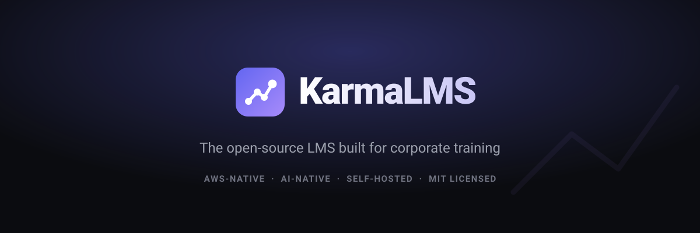
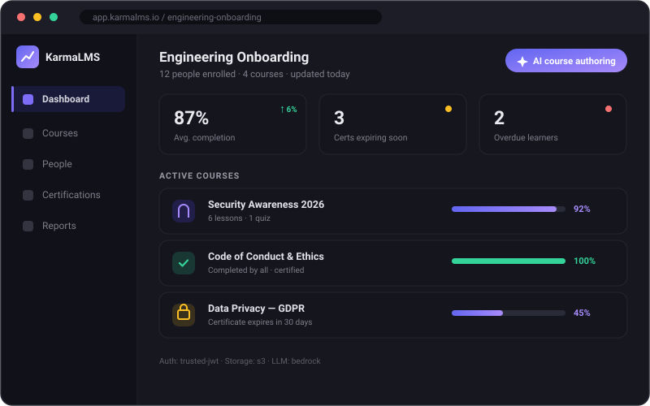

<div align="center">



[](LICENSE)
[](CONTRIBUTING.md)


[Landing page](https://ranjan98.github.io/karmalms/) · [Quickstart](#quickstart) · [Architecture](#architecture) · [Roadmap](#roadmap) · [Contributing](CONTRIBUTING.md)

</div>

<div align="center">
  
</div>

---

## Why KarmaLMS?

Almost every open-source LMS (Moodle, Open edX, Chamilo) is built for **schools** —
semesters, gradebooks, enrollment periods. Companies then bend those tools
painfully into doing employee onboarding and compliance training.

KarmaLMS is built for the **company** case from line one:

- **Onboarding paths** — sequenced courses auto-assigned by role, team, or start date.
- **Compliance tracking** — certifications with expiry dates and automatic lapse reminders.
- **Manager dashboards** — see who on your team is overdue, at a glance.
- **Runs on your infrastructure** — your AWS account, your S3, your identity provider.

## Bring your own everything

KarmaLMS owns as little as possible. Three pluggable adapters mean it slots into
infrastructure a company already has — configured by environment variables, no fork:

| Adapter | What you plug in | Modes |
|---|---|---|
| **Auth** | Your identity provider — KarmaLMS never stores passwords | `oidc` (Cognito/Okta/Azure AD/Auth0), `trusted-jwt` (append to your existing portal session), `saml` |
| **Storage** | Your object storage | S3-compatible: AWS S3, MinIO, Cloudflare R2 |
| **LLM** | Your AI provider — or none | `bedrock` (runs in your own AWS — data stays in your VPC), `openai`, `none` |

The whole app depends only on these interfaces. Swapping a provider is a config
change, not a code change. See [`src/lib/`](src/lib/).

## Quickstart

```bash
git clone https://github.com/ranjan98/karmalms.git
cd karmalms
cp .env.example .env
docker compose up
```

That boots the app, a Postgres (pgvector) database, and a MinIO S3 — **no AWS
account needed to try it**. Open <http://localhost:3000>.

Local development without Docker:

```bash
npm install
npm run db:push      # apply the schema
npm run dev
```

## Architecture

```
Next.js (App Router, TypeScript)  ──  one deployable
        │
        ├── Auth adapter      → your IdP        (src/lib/auth)
        ├── Storage adapter   → your S3         (src/lib/storage)
        ├── LLM adapter       → your AI / none  (src/lib/llm)
        └── Postgres + pgvector (Drizzle ORM)   (src/db)
```

- **No separate backend** — one Next.js app is far simpler for companies to deploy.
- **12-factor config** — every tunable is an env var; no secrets in code.
- **JIT user provisioning** — a user row is just `{ external_id, email, role, org }`.

## Customize without forking

- **Branding** — logo, colors, app name via env vars.
- **Theming** — the brand color is a CSS variable; override one file.
- **Login page** — fully replaceable component (and in `trusted-jwt` mode there is no login page at all).
- **Webhooks & API** _(roadmap)_ — integrate with your HRIS/Slack without touching core.

## Roadmap

| Version | Focus |
|---|---|
| **v0.1** | Core loop: create course → assign → learner completes → admin sees progress. OIDC + trusted-JWT auth, S3 storage, `docker compose up`. |
| **v0.2** | **Certifications with expiry + lapse reminders** (the headline feature). **AI course authoring** — paste a doc → drafted lessons + quiz. |
| **v0.3** | AI tutor (RAG grounded in course content), webhooks, REST API tokens, SAML adapter. |
| **Later** | SCIM provisioning, analytics, plugin hook system, theming marketplace. |

See [open issues](https://github.com/ranjan98/karmalms/issues) and
[`good first issue`](https://github.com/ranjan98/karmalms/labels/good%20first%20issue).

## Contributing

Contributions are very welcome — see [CONTRIBUTING.md](CONTRIBUTING.md) and our
[Code of Conduct](CODE_OF_CONDUCT.md). Good first issues are labeled.

## License

[MIT](LICENSE) — use it, modify it, ship it.
